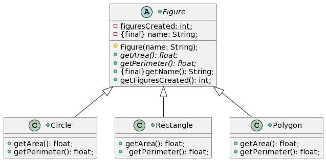

@startuml

+class Figure{
  -{static}figuresCreated: int;
  -{final} name: String;

  #Figure(name: String);
  +getArea(): float;
  +getPerimeter(): float;
  +{final}getName(): String;
  +getFiguresCreated(): int;
}

+class Circle extends Figure{
  +getArea(): float;
  +getPerimeter(): float;
}

+class Rectangle extends Figure{
  +getArea(): float;
  +´getPerimeter(): float;
}

+class Polygon extends Figure{
  +getArea(): float;
  +getPerimeter(): float;
}
@enduml